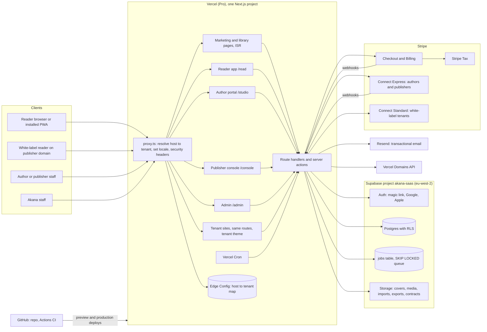
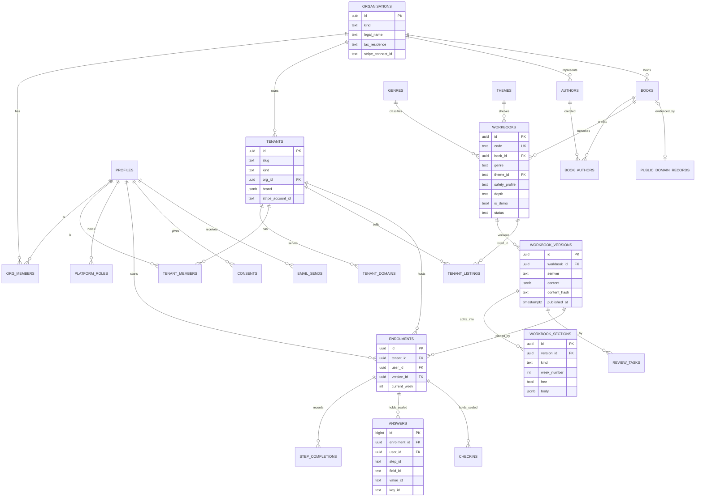
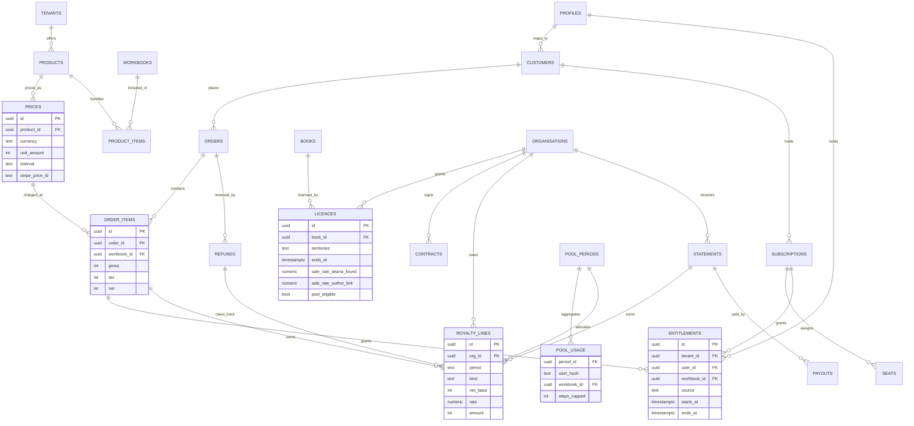

# Akana SaaS architecture

Version 1, 5 October 2026. Technical Architect with the Security and Data Engineer.

This note sets out how Akana is built on the stack Crent chose: Next.js App Router and TypeScript on Vercel, Supabase Postgres with row level security, Supabase Auth and Storage, Stripe Checkout, Billing, Tax and Connect, Resend for email, and a private GitHub repository (`crentparsow-cloud/akana`). It covers the app structure, the data model, the workbook schema, the migration of the current engine and the 20 Maya Vaughn workbooks, security, jobs, email, search, testing, environments and what fits in three weeks.

Inputs: the business summary, the four research notes in this folder, the handover of 5 October, the current engine (`app/src/index.html`), schema (`content/schema/workbook.schema.json`), validator (`tools/validate.py`), catalogue files and the nine SQL migrations in `db/`.

No commercial figures are set here. Every rate, price, cap and threshold is a column that Crent fills in. Points not yet confirmed are marked [check]. Points that need Crent are marked [Crent].

## 1. Principles

1. **One codebase, one database, many tenants.** The Akana marketplace is itself a tenant. A white-label publisher site is another tenant. Every row that belongs to a tenant carries `tenant_id`.
2. **Akana is the seller of record on the marketplace.** Research 3 found no merchant of record service that accepts a marketplace, and Research 4 found that curating every workbook under licence keeps Akana out of the UK Online Safety Act user-to-user scope and the heavier DSA tiers. The architecture assumes this. Crent has not yet confirmed it [Crent].
3. **Reader answers stay sealed.** Answers, check-ins and daily checks are encrypted with AES-256-GCM before they reach Postgres, as now. No author, publisher, tenant admin or Akana staff screen can read them. Only the reader, through their own session, can.
4. **Content is data, the engine is code.** A workbook is a validated JSON document. The reader app renders any valid workbook. Nothing about one book is hard-coded.
5. **The standing rules are enforced in code, not in policy alone.** The validator blocks claim words in wellbeing workbooks. Emails cannot accept a workbook title. Help now is a layout element in every wellbeing workbook. There is no streak counter in the schema. There are no third-party scripts in the Content Security Policy.
6. **Narrow launch, full platform.** The platform supports both models from day one. Launch switches on only what has been tested.

## 2. System diagram



## 3. App structure

One Next.js project in a small pnpm workspace. Splitting into several Vercel projects would multiply domains, cookies and deploys for no gain at this size.

```
akana/
  apps/web/                 Next.js App Router
    app/
      (marketing)/          home, for-authors, for-publishers, pricing, legal, help-now
      (library)/            browse, themes/[slug], authors/[slug], books/[code], search, cart
      read/[code]/          reader app: start, week/[n], exercise/[id], toolkit, plan, export
      account/              library, orders, subscription, settings, data export, delete
      studio/               author portal: books, workbooks, editor, preview, submissions, sales, payouts, contract
      console/              publisher console: imprint, authors, catalogue, team, sales, payouts, white-label setup
      admin/                review queue, safety review, licences, tenants, users, refunds, statements, audit
      t/[tenant]/           internal rewrite target for white-label sites (never linked directly)
      api/                  stripe webhooks, cron endpoints, export, import, domains
    proxy.ts                host to tenant resolution (Next.js 16 name for middleware)
  packages/
    schema/                 Workbook schema 2.0 as Zod, generated JSON Schema, TypeScript types
    validate/               TypeScript port of tools/validate.py (structure, house style, claims, counts)
    engine/                 reader components: exercise fields, toolkit, Help now, plan, PDF export
    db/                     generated Supabase types and typed query helpers
    seal/                   AES-256-GCM sealing, key ring, v1 compatibility
    emails/                 React Email templates (theme-only, no titles)
    money/                  price, tax, royalty and pool maths (pure functions, heavily tested)
  supabase/
    migrations/             SQL migrations, numbered
    seed/                   demo tenants, authors, books, workbooks (marked demo)
    tests/                  pgTAP RLS tests
  content/                  workbook JSON, catalogue, themes, support lines, covers (source of seed)
  e2e/                      Playwright
```

### 3.1 Surfaces

| Surface | Route | Who | Notes |
|---|---|---|---|
| Marketing | `(marketing)` | Everyone | Static or ISR. Author and publisher pitch. Pricing pulled from `prices`. |
| Library | `(library)` | Everyone | Store and subscription library. Browse by Theme, genre, author, language. Listing pages show title, author and AK- code. |
| Reader app | `/read/[code]` | Signed-in readers with an entitlement, or the free first week | The current engine rebuilt as React components. Offline via a service worker for the sections already loaded. Help now pinned in wellbeing workbooks. |
| Account | `/account` | Readers | Purchases, subscription (Stripe customer portal), consents, export of own answers as PDF and JSON, deletion. |
| Author portal | `/studio` | Authors and their editors | Create book records, build workbooks in a structured editor, import DOCX, preview as reader, submit for review, see aggregate sales and pool statements, connect payouts, view the signed licence. |
| Publisher console | `/console` | Publisher staff | Everything in Studio across an imprint's authors, plus team roles, bulk import, and white-label site setup (brand, domain, prices, Connect Standard). |
| White-label sites | any tenant host | Tenant readers | Same library and reader routes, served with tenant branding, catalogue and prices. Proxy rewrites to `/t/[tenant]/...`. |
| Admin | `/admin` | Akana staff | Editorial and safety review queues, licence register, public-domain file, tenant management, refunds, statements and payouts, audit log. Admin reads are logged. |

### 3.2 Hosts and tenancy routing

- Akana marketplace and all signed-in dashboards run on the main apex (domain not yet chosen [Crent]).
- White-label subdomains run on a separate suffix so tenant pages never share cookie scope with the dashboard (Research 2). Submit that suffix to the Public Suffix List [check].
- Custom domains are added through the Vercel Domains API (`addProjectDomain`, then `verifyProjectDomain`). The publisher console shows the DNS records to set and polls verification through a background job.
- `proxy.ts` reads the host, looks it up in Edge Config (falling back to the `tenant_domains` table), sets an `x-akana-tenant` header and rewrites. Unknown hosts get a 404, never the marketplace.
- Auth cookies use the `__Host-` prefix, `Secure`, `HttpOnly`, no `Domain` attribute. Server actions check `Origin`.
- Vercel Pro is the minimum plan, because Hobby caps custom domains and does not allow commercial use [check current Vercel terms].

### 3.3 Rendering and data access

- Public catalogue pages are server-rendered with ISR and revalidated by tag when a workbook version is published.
- Reader and dashboard pages are dynamic. They use a Supabase server client bound to the user's session, so RLS applies to every query.
- The service role key is used only in route handlers that need it (webhooks, cron, sealing writes on behalf of the signed-in user after checks). It lives in a `server-only` module and is never in a client bundle. A CI check fails the build if the key name appears in client code.
- The reader loads one week's sections at a time through an entitlement-checked query. The full workbook JSON is never sent to a browser that has not paid for it.

## 4. Data model

All tables live in `public` unless stated. Every table has RLS on. Default grants to `anon` and `authenticated` are revoked and given back table by table. Money is stored in minor units with an ISO currency code. Times are `timestamptz`. Rows are soft-deleted only where audit needs it.

### 4.1 Entity list

**Tenancy and identity**

| Entity | Purpose | Key columns |
|---|---|---|
| `tenants` | A storefront. The Akana marketplace is tenant `akana`. Each white-label site is a tenant. | `id`, `slug`, `kind` (marketplace, white_label), `org_id`, `brand` (json: name, logo path, colours, fonts), `default_locale`, `default_currency`, `status`, `stripe_account_id` (white-label only), `seller_of_record` |
| `tenant_domains` | Hosts mapped to tenants. | `host`, `tenant_id`, `verified_at`, `vercel_status` |
| `organisations` | A business that owns content: a publisher, an author's own company, or a sole author. | `id`, `kind` (publisher, author_company, individual), `legal_name`, `country`, `tax_residence`, `treaty_declaration`, `stripe_connect_id`, `status` |
| `profiles` | One row per auth user. Carries display name and locale, never health data. | `user_id`, `display_name`, `locale`, `country`, `created_at` |
| `org_members` | Staff roles inside an organisation. | `org_id`, `user_id`, `role` (owner, admin, editor, finance, viewer) |
| `tenant_members` | A reader's or admin's link to a tenant. One shared identity, per-tenant membership (Research 2 recommendation) [Crent]. | `tenant_id`, `user_id`, `role` (reader, tenant_admin, tenant_editor), `joined_at` |
| `platform_roles` | Akana staff roles. Mirrored into `app_metadata` by a custom access token hook. | `user_id`, `role` (admin, editor, safety_reviewer, support, finance) |

**Catalogue**

| Entity | Purpose | Key columns |
|---|---|---|
| `authors` | A public author identity. Can belong to an organisation. Demo authors are flagged. | `id` (AU- code), `org_id`, `name`, `slug`, `bio`, `country`, `photo_path`, `is_demo`, `is_public_domain` |
| `books` | The source book. Title-first identity. | `id`, `org_id`, `title`, `subtitle`, `edition`, `language`, `isbns` (json), `store_links` (json), `cover_path`, `rights_status` (licensed, public_domain, own_work), `public_domain_record_id` |
| `book_authors` | Many authors per book, with role (author, translator, editor). | `book_id`, `author_id`, `role`, `sort` |
| `workbooks` | The product identity. Permanent AK- code. | `id`, `code` (AK-XXXXX, unique, never reused), `book_id`, `org_id`, `genre`, `theme_id`, `safety_profile` (none, wellbeing_standard, wellbeing_higher), `depth` (listing, outline, first_week, full), `is_demo`, `status` (draft, in_review, approved, published, withdrawn), `current_version_id` |
| `workbook_versions` | Immutable published content. A reader's enrolment pins a version. | `id`, `workbook_id`, `semver`, `schema_version`, `content` (jsonb, full document), `content_hash`, `validated_at`, `approved_by`, `safety_approved_by`, `published_at` |
| `workbook_sections` | The published version split into loadable parts, so RLS can gate each part. | `id`, `version_id`, `kind` (listing, start, week, toolkit, finish, keep_going, help), `week_number`, `body` (jsonb), `free` (bool) |
| `themes` | Shared positive shelves across authors (carried from `themes.json`). | `id`, `name`, `slug`, `status`, `min_books`, `topics` (hidden search terms) |
| `genres` | Fixed list: wellbeing, personal development, relationships, parenting, career, leadership, business, productivity, finance, education, life skills. | `id`, `name`, `default_safety_profile`, `guardrails` (json) |
| `tenant_listings` | Which workbooks a tenant sells, with tenant-specific sort and visibility. | `tenant_id`, `workbook_id`, `visible`, `sort`, `featured` |
| `review_tasks` | Editorial, safety and rights review for each submitted version. | `id`, `version_id`, `kind` (editorial, safety, rights, accessibility), `assignee`, `outcome`, `notes`, `decided_at` |
| `imports` | DOCX or EPUB uploads converted to draft workbooks. | `id`, `org_id`, `file_path`, `format`, `status`, `draft_workbook_id`, `log` |
| `support_lines` and `markets` | Help now content by market (carried from `support_lines.json` and `markets.json`). | `market`, `group`, `label`, `number`, `how`, `hours`, `url`, `verified_at` |

**Commerce**

| Entity | Purpose | Key columns |
|---|---|---|
| `products` | What can be bought: a single workbook, a bundle, a subscription plan, a team plan. | `id`, `tenant_id`, `kind` (workbook, bundle, subscription, team), `workbook_id` or null, `name`, `active` |
| `product_items` | Workbooks inside a bundle. | `product_id`, `workbook_id` |
| `prices` | One row per product, currency and interval. GBP leads. Fixed prices in GBP, EUR, USD, AUD, CAD, NZD, with Stripe Adaptive Pricing for the rest (Research 3) [Crent]. | `id`, `product_id`, `currency`, `unit_amount`, `interval` (one_off, month, year), `tax_behaviour` (inclusive), `stripe_price_id`, `active` |
| `customers` | Stripe customer per user per Stripe account. | `user_id`, `tenant_id`, `stripe_customer_id`, `country` |
| `orders` and `order_items` | A completed checkout. Item lines carry net amounts for royalty maths. | `order_id`, `tenant_id`, `user_id`, `stripe_checkout_id`, `currency`, `gross`, `tax`, `stripe_fee`, `net`; item: `product_id`, `workbook_id`, `gross`, `tax`, `net` |
| `subscriptions` | Library or team subscription mirrored from Stripe. | `id`, `tenant_id`, `user_id` or `org_id`, `price_id`, `status`, `current_period_end`, `cancel_at`, `seats` |
| `seats` | Team plan seat assignments. Admins see uptake counts only. | `subscription_id`, `user_id`, `assigned_at` |
| `entitlements` | The single source of access. Written only by server code (webhook, admin grant, free week). | `id`, `tenant_id`, `user_id`, `workbook_id` or null (null means library-wide), `source` (purchase, subscription, seat, free_week, comp, gift), `source_ref`, `starts_at`, `ends_at`, `revoked_at` |
| `refunds` | Refunds and disputes, linked to orders. Reverse royalty lines. | `id`, `order_id`, `amount`, `reason`, `stripe_refund_id` |
| `processed_stripe_events` | Webhook idempotency (carried over). | `event_id`, `received_at` |

**Rights, contracts and money out**

| Entity | Purpose | Key columns |
|---|---|---|
| `licences` | The interactive-workbook licence per book (Research 4 heads of terms). | `id`, `book_id`, `org_id`, `grant` (json), `territories`, `excluded_territories`, `starts_at`, `ends_at`, `exclusive_until`, `sale_rate_akana_found`, `sale_rate_author_link`, `pool_eligible`, `advance`, `status`, `signed_document_path` |
| `contracts` | Signed agreements of any type: licence, white-label SaaS terms, data processing agreement. | `id`, `org_id`, `kind`, `version`, `signed_at`, `signed_by`, `document_path` |
| `public_domain_records` | Evidence file per classic: author and translator death dates, first publication, edition used, tier A or B (Research 4). | `id`, `book_id`, `people` (json), `first_published`, `source_edition`, `tier`, `checked_by`, `checked_at` |
| `royalty_lines` | Ledger. One line per sale item, refund or pool allocation. Append-only. | `id`, `org_id`, `workbook_id`, `period`, `kind` (sale, refund, pool, adjustment, withholding), `currency`, `net_base`, `rate`, `amount`, `source_ref` |
| `pool_periods` | Monthly subscription pool. | `id`, `tenant_id`, `period`, `currency`, `net_receipts`, `author_share_rate`, `status` (open, closed, paid) |
| `pool_usage` | Aggregated per subscriber per workbook per period: count of capped completed steps. No answer content. | `period_id`, `user_hash`, `workbook_id`, `steps_capped` |
| `statements` | Monthly statement per organisation. | `id`, `org_id`, `period`, `currency`, `total`, `withholding`, `pdf_path`, `status` |
| `payouts` | Stripe transfer and payout records. | `id`, `statement_id`, `stripe_transfer_id`, `amount`, `currency`, `status`, `paid_at` |

**Reader data (sealed)**

| Entity | Purpose | Key columns |
|---|---|---|
| `enrolments` | A reader started a workbook on a tenant. Pins the version. | `id`, `tenant_id`, `user_id`, `workbook_id`, `version_id`, `started_at`, `current_week`, `finished_at` |
| `step_completions` | Which steps are done. Not sealed (no free text), used for progress and pool counts. | `enrolment_id`, `step_id`, `attempt`, `completed_at` |
| `answers` | Reader answers. `value_ct` is ciphertext only. | `id`, `enrolment_id`, `user_id`, `step_id`, `field_id`, `attempt`, `value_ct`, `key_id`, `updated_at` |
| `checkins` | Weekly check-ins and daily checks, sealed. | `id`, `enrolment_id`, `user_id`, `kind`, `week`, `value_ct`, `key_id`, `created_at` |
| `toolkit_uses` and `milestones_earned` | Carried over. Counts only, never a streak. | as now |
| `exports` | Reader's own PDF or JSON export, short-lived signed file. | `id`, `user_id`, `path`, `expires_at` |

**Email, consent, privacy and audit**

| Entity | Purpose | Key columns |
|---|---|---|
| `consent_versions` and `consents` | Carried over. Append-only consent history, per tenant. | `user_id`, `tenant_id`, `type`, `version`, `granted`, `at` |
| `email_sends` | What was sent, to whom, by template. Stores the Theme id, never a workbook title. | `id`, `user_id`, `tenant_id`, `template`, `theme_id`, `resend_id`, `status`, `sent_at` |
| `suppressions` | Hashed addresses that must not be emailed (carried from `blocked_addresses`). | `address_hash`, `reason` |
| `partners`, `partner_tokens`, `partner_sends` | The existing support partner feature, carried over unchanged in shape. | as now |
| `events` | First-party product events. Insert only by readers, read only through aggregate views with small-number suppression. | `id`, `tenant_id`, `user_hash`, `name`, `props`, `at` |
| `audit_log` | Every privileged action: role changes, approvals, refunds, payouts, licence edits, tenant domain changes, admin reads. Append-only, no update or delete grant to anyone. | `id`, `actor`, `action`, `target`, `tenant_id`, `before`, `after`, `ip_hash`, `at` |
| `deletion_requests` and `deleted_account_records` | Carried over. | as now |
| `jobs` | Background work queue. | `id`, `kind`, `payload`, `run_at`, `attempts`, `locked_until`, `last_error`, `done_at` |
| `app_config` | Carried over. Key and value config, including the cutoff values the old migrations use. | `key`, `value` |

### 4.2 ERD: tenancy, catalogue and reader data



### 4.3 ERD: commerce, rights and royalties



## 5. Workbook schema 2.0

The current schema (v1.0) is built for one programme shape: 12 weeks, four fixed stages named Explore, Build, Practice and Keep, a 12 to 20 item self-check, 22 to 24 exercises and 8 to 10 toolkit cards. That suits wellbeing. It does not suit a 4-week finance course, a 30-day leadership programme or a parenting workbook used as a reference. Version 2.0 keeps every v1 concept and makes the shape a setting.

### 5.1 What changes

| Area | v1.0 | v2.0 |
|---|---|---|
| Identity | `id`, `topic_name`, `set_id`, `code`, `source_book` with manuscript file | `code` (AK-), `book_ref` (book id, title, authors), `genre`, `theme_id`, `language` (BCP 47), `spelling` (en-GB, en-US and so on), `is_demo`, `depth` |
| Safety | `safety_tier` standard or higher | `safety_profile`: none, wellbeing_standard, wellbeing_higher. Wellbeing profiles require `help_now: true`, ban scored self-checks, and run the claim-word rules. Finance requires an `advice_guardrail` note [check FCA wording]. |
| Structure | 12 weeks, 4 named stages | `structure.unit` (week, day, module, chapter), `structure.count` (1 to 52), optional `stages` (0 to 6, names free) |
| Self-check | Required, 12 to 20 items, 5-point scale | Optional `reflection_check`. In wellbeing it is unscored and shows no bands (existing decision). In other genres it can be a scored `assessment` with bands. |
| Exercises | Fixed field types, 3 to 15 minutes, 3 to 7 steps | Same plus new field types: `multiple_choice`, `quiz` (with answer key, non-wellbeing only), `number`, `money` (currency aware), `table` (author-defined columns), `date`, `link_list`. `prefill_from` carries an answer from an earlier field. Minutes range widened to 1 to 60. |
| Steps | Exercises only | A step is any completable unit: `reading`, `exercise`, `reflection`, `checkin`, `assessment`, `toolkit_try`. Pool counts use completed steps, capped. |
| Toolkit | 8 to 10 cards, 1 to 2 minutes | `toolkit` optional, 0 to 20 cards, any length |
| Milestones | Trigger strings | Same triggers. No trigger based on consecutive days is allowed, so no punishing streaks. |
| Media | Stick figure pose ids | `figure` ids plus optional `media` references to Storage paths (image, audio). Alt text required. |
| Sources | Chapter reference | Chapter reference plus `quote` with a word count, so the validator can flag long quotation from licensed books |
| Localisation | None | `language`, `spelling`, and an optional `translations` map of string ids for later |
| Accessibility | None | `a11y` block: reading level target, alt text present, audio transcripts present |

### 5.2 Validation

The validator becomes `packages/validate` in TypeScript so the author portal, CI and the seed loader share one implementation. It runs:

1. Schema structure (Zod, with the JSON Schema exported for outside tools).
2. House style by `spelling`. The current rules treat UK spellings as errors because the Maya Vaughn reader copy is US English. In v2 the spelling list follows the workbook's `spelling` value, so a British author's workbook is checked for British spelling.
3. Claim words, banned characters and emoji, for every genre. The effectiveness list applies in full to wellbeing and in a reduced form elsewhere (no "guaranteed", no income promises in finance and business).
4. Genre guardrails from the `genres` table.
5. Cross-references and counts. Counts come from a per-genre profile, not one fixed set.
6. Depth rules: `listing` needs listing fields and a cover; `outline` adds every unit with a focus line; `first_week` adds full content for unit 1; `full` needs everything.

A version can be published only with a clean validation run stored against it, an editorial approval, and for wellbeing a safety approval.

## 6. Migrating the current engine and the 20 workbooks

### 6.1 Engine

The engine in `app/src/index.html` is a 178 KB single-page app. It is rebuilt, not wrapped. The behaviour is the specification:

| Current piece | New home |
|---|---|
| Week and exercise rendering, field types | `packages/engine` React components, one per field type |
| Toolkit, plan sections, finish, keep going | `packages/engine` components |
| Safety hub and Help now by market | `packages/engine/help-now`, data from `support_lines` and `markets` tables, market from the reader's country with a manual switch |
| Locale (`locale.js`) | Next.js i18n with message files; UK English first |
| Passkeys (`webauthn.js`) | Deferred. Launch with magic link, Google and Apple (Research 2). Passkeys return after launch [check Supabase native passkey support]. |
| Service worker (`sw.js`) | A new service worker scoped to `/read`, caching loaded sections and the shell. Answers queue offline and are sealed on sync. |
| Supabase edge functions (`answers`, `app`, `create-checkout`, `stripe-webhook`) | Next.js route handlers and server actions on Vercel |
| `seal.ts` | `packages/seal` (same Web Crypto API, now on Node) |
| `emails.ts`, `mailer.ts` | `packages/emails` with React Email, sent through Resend |
| `respond.html` (partner reply page) | `/respond/[token]` route |

### 6.2 Data

- The new Supabase project `akana-saas` starts empty. The live Focus test data in `workbooks-dev` is not copied. Test readers re-enrol. This avoids carrying test health data into the new system.
- The nine SQL migrations are not replayed. Their rules are carried into new migrations: consent history, `has_access` and the free first week, write locks after deletion requests, daily and self-check locks, owner funnel views with suppression, and the news consent opt-in.
- `catalog.json`, `themes.json`, `markets.json` and `support_lines.json` become seed data.

### 6.3 Workbooks

A script `scripts/migrate-v1.ts` converts each v1 file to v2:

- `topic_name` and `set_id` move to listing metadata. `set_id` maps to the Mind and Mood Theme, with the hidden topic terms kept.
- `safety_tier` standard or higher maps to `wellbeing_standard` or `wellbeing_higher`.
- `structure` is set to 12 weeks with the four named stages.
- `selfcheck` becomes an unscored `reflection_check`.
- Exercises keep their ids, so the AK- codes and any existing references survive.
- `source_book.manuscript_file` is dropped from the published content and kept in an internal field.
- `is_demo` is false. Maya Vaughn is a real pen name with real books.
- Each converted file must pass the v2 validator. The 20 workbooks have parked content issues (handover item 7), so they load as `in_review`, not `published`, until Crent clears them [Crent].

## 7. Security

### 7.1 Authentication and roles

- Supabase Auth with magic link, Google and Apple. SAML SSO is an enterprise add-on after launch.
- Authorisation reads `app_metadata` only, never `user_metadata`, because users can edit the latter.
- A custom access token hook adds `platform_roles` to the token. Org and tenant membership are checked in SQL through security definer functions, so a stale token cannot keep a revoked role for long.

### 7.2 RLS patterns

Helper functions, all `security definer`, `stable`, with `search_path` pinned:

```sql
create function app.is_platform(p_role text) returns boolean ...
create function app.is_org_member(p_org uuid, p_roles text[]) returns boolean ...
create function app.is_tenant_member(p_tenant uuid, p_roles text[]) returns boolean ...
create function app.has_entitlement(p_user uuid, p_tenant uuid, p_workbook uuid, p_unit int) returns boolean ...
```

Policies call them as `(select app.is_org_member(org_id, array['owner','admin','editor']))` so Postgres evaluates them once per statement. Every `tenant_id`, `org_id` and `user_id` column used in a policy is indexed.

| Table group | Read | Write |
|---|---|---|
| Public catalogue (`workbooks` listing columns, `books`, `authors`, `themes`, `prices`, published `listing` sections) | Anyone, filtered to the request tenant's listings | Org editors for their own drafts; platform editors |
| `workbook_sections` beyond the free unit | Readers where `has_entitlement` is true for that tenant, workbook and unit | Server only, at publish |
| `workbook_versions.content` | Owning org and platform reviewers | Server only, at submit and publish |
| Drafts, imports, review tasks | Owning org members; platform editors and safety reviewers | Same |
| `orders`, `subscriptions`, `entitlements` | The reader for their own rows; tenant admins see tenant totals through views only | Server only (webhook and admin actions) |
| `royalty_lines`, `statements`, `payouts` | Org owners and finance role for their own org; platform finance | Server only |
| `licences`, `contracts` | Owning org owners; platform admin and finance | Platform admin |
| `answers`, `checkins` | The owning user only, ciphertext column only | The owning user through a server route that seals the value |
| `step_completions`, `toolkit_uses`, `milestones_earned` | Owning user | Owning user, checked by the entitlement trigger |
| `events` | Nobody directly. Aggregate views with suppression of counts under the threshold in `app_config` | Owning user insert only |
| `audit_log` | Platform admin | Insert through a security definer function only. No update or delete grant. |

pgTAP tests prove each rule from the other side: an author cannot read another org's sales, a tenant admin cannot read a reader's answers, a reader on tenant A cannot load a section entitled only on tenant B, and nobody can update the audit log.

### 7.3 Sealing reader answers

- AES-256-GCM, 12-byte random IV, as now.
- Additional authenticated data becomes `user_id|tenant_id|field path`, so a sealed value cannot be moved to another account, tenant or field.
- A key ring replaces the single `ANSWERS_KEY`. Format `v2.<key_id>.<base64>`. New writes use the active key. Old keys stay for reading. Rotation re-seals in a background job. `v1.` values are still readable, for any test data that is ever imported.
- Keys live in Vercel environment variables marked sensitive, production only. They are never stored in Postgres. A key held in a dedicated secret manager is a later step [check whether Vercel sensitive variables meet the bar for health data].
- Decryption happens only in server code acting for the signed-in owner. There is no admin endpoint that decrypts.
- The reader's PDF export is generated server side, watermarked with the buyer's name, stored for a short time, and deleted by a job.

### 7.4 Other controls

- **Secrets:** Supabase service role, Stripe secret and webhook secrets (platform and Connect), Resend key, Vercel API token for domains, answer keys. All in Vercel environment variables, split by environment. GitHub Actions gets only test-mode keys.
- **Webhooks:** signature checked, event id stored before processing for idempotency, processing done in a job so the endpoint replies fast.
- **Headers:** strict CSP with nonces and no third-party script origins (no ad pixels by construction), HSTS, frame-ancestors none except for the partner page if needed, Referrer-Policy strict-origin-when-cross-origin, Permissions-Policy closed by default.
- **Rate limits:** Vercel Firewall rules for sign-in, checkout and export routes, plus a Postgres counter for per-user limits on section loads (deters scraping).
- **Content protection:** entitlement-gated sections, signed short-lived media URLs, rate limits and watermarked exports. Assistive technology is never blocked. Publishers are told plainly this deters casual copying and does not prevent it.
- **Admin access:** every admin read of a user record writes to `audit_log`. Staff accounts require Google sign-in on a company domain [Crent].
- **Data protection:** Akana is controller on the marketplace and processor on white-label sites (Research 2) [check legal]. Data stays in the London region. A records-of-processing entry and a DPIA for health data are needed before launch [check legal].

## 8. Payments and money flow

- **Marketplace:** Stripe Checkout on the Akana platform account, with Stripe Tax on the platform's registrations. Single purchases and subscriptions are charged on the platform. Authors and publishers are paid by monthly transfers to Connect Express accounts after the refund window, from `statements`. This is the separate charges and transfers pattern, which Stripe Tax supports for platform liability (Research 3).
  - This differs from Research 2, which proposed destination charges for single sales. Separate charges and transfers for everything gives one ledger, one payout day and simpler refunds. Destination charges remain possible later [Crent].
- **Subscription pool:** monthly. Net receipts after VAT and Stripe fees, times the author share rate, split user-centrically by capped completed steps (Research 3). Akana's share, the cap and the activity floor are columns, not code [Crent].
- **White-label:** direct charges on the publisher's own Connect Standard account with an application fee, if the publisher is the seller of record [Crent]. The publisher's account carries refunds and disputes.
- **Withholding:** organisations record tax residence and a treaty declaration at onboarding. The statement job applies a withholding line where UK rules require it [check with accountant].
- **Webhooks handled:** `checkout.session.completed`, `invoice.paid`, `invoice.payment_failed`, `customer.subscription.updated` and `deleted`, `charge.refunded`, `charge.dispute.created`, `account.updated` (Connect), `transfer.created`, `payout.paid` and `failed`.

## 9. Background jobs

Vercel Cron calls protected route handlers. Handlers drain the `jobs` table with `for update skip locked`, with retries and backoff. No extra queue service is needed at launch.

| Job | Trigger | Notes |
|---|---|---|
| Process Stripe event | Webhook | Writes orders, entitlements, royalty lines |
| Send email | Any event | Resend, with consent and suppression checks |
| Weekly reminder | Daily cron | Only to readers who opted in. Theme-only wording. Never a missed-days message. |
| Close pool period | Monthly cron | Aggregates `step_completions` into `pool_usage`, allocates the pool |
| Build statements | Monthly cron after pool close | PDF to Storage, email to org finance contacts |
| Pay statements | Fixed payout day [Crent] | Stripe transfers above the minimum threshold [Crent] |
| Verify custom domain | On add, then every 10 minutes for 48 hours | Vercel Domains API, updates Edge Config |
| Import DOCX or EPUB | On upload | Mammoth for DOCX, EPUB reading order for EPUB, then v2 validator, result as draft |
| Render reader export | On request | Server-side PDF, watermarked, deleted after expiry |
| Revalidate catalogue | On publish | Next.js tag revalidation |
| Refresh search | On publish | Updates the search vector |
| Key rotation | Manual | Re-seal answers to the new key |
| Deletion and retention | Daily cron | Carries the current 30-day deletion rule [check value in `app_config`] |

## 10. Email

- Resend with a verified sending domain per environment. White-label tenants send from Akana's domain with the tenant's name at launch. Sending from a tenant's own domain comes later.
- Templates are React Email components in `packages/emails`. Their props type accepts a `themeName`, never a workbook title or book title. A unit test renders every template with every Theme and checks no catalogue title appears. This carries the rule that emails never name a workbook.
- Transactional mail (receipts, sign-in links, statements) is sent without marketing consent. Anything else needs a recorded consent for that tenant. The news opt-in from migration 009 carries over.
- Receipts name the product as "a workbook" or the bundle name and code, never the title [check whether receipts need the title for VAT invoices; if so, the VAT invoice is a separate PDF in the account area].

## 11. Search

Postgres full-text search, no outside service at launch.

- A generated `tsvector` on workbooks combining title, subtitle, author names, Theme name, genre and the hidden Theme topic terms, using the `simple` configuration plus `unaccent` so it works across languages.
- `pg_trgm` for typo-tolerant author and title matching.
- Facets: genre, Theme, author, language, length, price band, free first week.
- Search runs per tenant, through the `tenant_listings` join.
- Search queries are not logged with a user id.

## 12. Testing and CI

GitHub Actions on every pull request:

1. Install, typecheck (`tsc --noEmit`), lint.
2. Unit tests with Vitest: schema, validator, sealing round trip and tamper checks, money maths (tax-inclusive net, fee deduction, pool split, refunds, rounding), email title check.
3. Content check: every file in `content/workbooks` and the seed set passes the v2 validator. Banned characters fail the build.
4. Database: `supabase start`, apply migrations, run pgTAP RLS tests.
5. End to end with Playwright against the Vercel preview and Stripe test mode: browse, free first week, buy a single workbook, subscribe, read and answer, export, author submits and admin approves, white-label host renders its own catalogue.
6. Accessibility: axe checks in Playwright on key pages, target WCAG 2.2 AA. Keyboard-only run of the reader.
7. Secret scan and a check that the service role key name is absent from client bundles.

Merges to `main` deploy to production only after the checks pass and a manual promote.

## 13. Environments

| Environment | Web | Database | Stripe | Email |
|---|---|---|---|---|
| Local | `next dev` | `supabase start` (Docker) | Test mode, Stripe CLI forwarding | Resend test key, local preview |
| Preview | Vercel preview per pull request | A second Supabase project `akana-staging` [Crent: needs creating; branching is an alternative on a paid plan] | Test mode | Resend test domain |
| Production | Vercel production, main apex and tenant domains | `akana-saas` (ref suiuyolccgyjglfwgwnw, eu-west-2) | Live mode, after Connect platform approval | Resend live domain |

Seed data, including the demo workbooks, loads into local and preview always, and into production only with the `is_demo` flag shown on every demo listing.

## 14. What fits in three weeks

Dates: Monday 5 October to Friday 23 October 2026.

**Week 1 (5 to 9 October): foundation**
- Repo, workspace, CI, Vercel project, environments, secrets.
- Migrations for tenancy, identity, catalogue, reader data, consents, audit, jobs. RLS and pgTAP tests.
- Workbook schema 2.0, TypeScript validator, v1 migration script, seed loader.
- Reader app: all field types, week view, toolkit, Help now, sealing, offline shell.
- Library: browse, Theme and author pages, listing page, search.

**Week 2 (12 to 16 October): money and authors**
- Stripe Checkout for single workbooks, bundles and the library subscription, Stripe Tax, customer portal, webhooks, entitlements, refunds.
- Free first week.
- Author portal: book records, structured editor, preview, DOCX import, submit. Admin review queue with editorial and safety steps.
- Connect Express onboarding and the organisation tax fields.
- Emails: sign-in, receipt, welcome, weekly reminder, statement.
- Demo content loaded: about 50 workbooks, 17 or more authors.

**Week 3 (19 to 23 October): white-label, payouts, hardening**
- Tenants, tenant branding, subdomain and custom domain flow, tenant catalogue and prices.
- Publisher console with team roles.
- Royalty ledger, monthly pool close, statements, transfers (test mode end to end).
- Reader export, account deletion, data export.
- Accessibility pass, security review, load test of the reader and webhook paths, production go-live checklist.

**Built but switched off at launch unless tested:** white-label direct charges on Connect Standard, team seats, EPUB import.

**Not in three weeks:** SAML SSO, native apps, sending from tenant domains, translations of the interface beyond English, author-facing reader analytics beyond aggregate counts, AI features, PDF import.

**Outside the code but needed to sell** (from the handover): a company, a domain, a trade mark check on Akana, terms, privacy policy, licence and white-label agreements, Stripe platform and Connect approval, the VAT approach and registrations, a support address, and at least some real licensed workbooks. Demo content cannot be sold.

## 15. Decisions needed from Crent

1. Confirm Akana is seller of record and curates every workbook (shapes VAT, DSA, Online Safety Act and payments).
2. Separate charges and transfers for all marketplace sales, or destination charges for single sales.
3. Seller of record on white-label sites.
4. One shared reader identity across Akana and tenant sites, with per-tenant membership.
5. Main domain and the separate tenant suffix.
6. A second Supabase project for staging, or Supabase branching.
7. Fixed currencies at launch (proposed GBP, EUR, USD, AUD, CAD, NZD) and Adaptive Pricing for the rest.
8. All rates, the pool method's caps, the payout day and threshold.
9. Whether the 20 Maya Vaughn workbooks are listed at launch while their content issues are parked.
10. Whether passkeys must be in the launch build.

## Sources

Internal: `docs/saas/research_market.md`, `research_whitelabel.md`, `research_money.md`, `research_rights.md`, `AK_Handover_2026-10-05.md`, `Akana_conversation_summary.md`, `content/schema/workbook.schema.json`, `tools/validate.py`, `functions/_shared/seal.ts`, `db/001` to `db/009`. External facts on Vercel, Supabase, Stripe and the EAA are taken from the research notes, which cite their sources.
